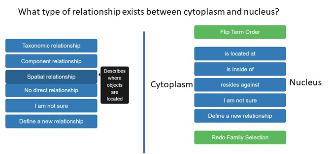

# The Waters Relationship Selection Task (WRST)


This is an end-to-end web user interface tool for crowd-sourced [relationship extraction](https://en.wikipedia.org/wiki/Relationship_extraction) from a text passage, given a set of terms pre-annotated from said text. This naturally requires a term/keyword extraction pre-processing step, for which there are many automated tools (for example, [spaCy](https://spacy.io)). Relationship extraction, however, is much trickier to automate given the presence of additional context and semantics. Therefore, WRST implements a straightforward, visually-guided Q&A tool for human labelers to quickly and accurately determine relationships, if any, between words.

The following image shows an example relation extraction task for humans (text passage display not shown). The users read the text passage and answer the question.



## Getting Started

These instructions will get you a copy of the project up and running on your local machine for development and testing purposes. See deployment for notes on how to deploy the project on a live system such as Heroku.

### Prerequisites

To run the app locally you will need to have the following installed:

* Anaconda Python (tested with 3.8.3)
* redis-server
* postgres (psql)

## Installing

Once you have cloned the repository you should create a virtual environment to work in, making sure to use the Anaconda version of python:

```
virtualenv env -p /path/to/anaconda/python
source env/bin/activate
```

Now you can install the appropriate packages via the requirements.txt file:

```
pip install -r requirements.txt
```

This should install all the packages that you need to run the app.

### Troubleshooting Installation

If your `pip install -r requirements.txt` fails, you probably need to install packages manually. You can try to do a `pip install numpy scipy matplotlib pandas` to see whether your virtual environment can be set up with default versions of these packages. The package `psycopg2` installs from the binary, but you may need to build it from source by doing a `pip install psycopg2`. Keep in mind that building from source requires lots of compiler packages, so please refer to [their official documentation](https://www.psycopg.org/docs/install.html) for more help.

### Enable environment variables (each run)

In your .env file located in the root directory confirm that your environment variables point to the correct locations:

```
source env/bin/activate
export APP_SETTINGS="config.DevelopmentConfig"
export DATABASE_URL="postgresql://localhost/wrst"
export REDIS_URL="redis://localhost:6379"
export TEST_DATABASE_URL="postgresql://localhost/wrst"
```

Depending on how you installed postgres, you may need to enter your database password into the `DATABASE_URL` variable, using the following schema

```
postgresql://[user[:password]@][netloc][:port][/dbname]
```

so if your user is `john` and your password is `123456` then your `.env` file would show `export DATABASE_URL="postgresql://john:123456/wrst"`

Now activate the variables:

```
source .env
```

## Configuring the database locally

Before running the app locally, you need to configure and specify the database that will be used for logging.  This can be done in two steps:

Step 1: Start Postgres

This varies from platform to platform, so refer to the documentation for your version of postgres.

Step 2: Create a local database

Note we are using the name wrst here to match the environment variable set above.  You can name the database whatever you'd like but it needs to be consistent.

```
CREATE DATABASE wrst;
```

There are a variety of tables that will be created and populated by the app (users, relationships). You will not need to create these as the app will do this upon launch time.  The one exception to this is the tasks table, which must be generated via a script before running the app.  Not doing this will result in the app not being able to find any relationships selection tasks for the user.

### Populating the task table

Populating the task table is done by running the create_task_database.py script in the scripts directory: 

```
cd scripts
python create_task_database.py
```

This file contains links to a sentence file and term file that can changed for whichever experiment is being run.

## Running the app locally

You will need to have a local redis-server instance running.  To do this, open a new terminal window and type:

```
redis-server
```

(Optional) If you want to see the database writes while the app is running you can do this by opening a terminal window and typing:

```
psql wrst
```

Now, you can run the app itself. Open another terminal window and go to the root level directory of the wrst app.  Now type:

```
python -m wrst.app
```

(if you get a `KeyError` you need to add the variables from the `.env` file to your environment)

You can then open your browser and type the following URL:

```
http://127.0.0.1:5000/login_test
```

which should show the consent form for test users.

## Other configurations

The login_test route gives a nice way to test things locally without having to supply user ids and cohorts.

Here are the other two routing possibilities:

```
http://127.0.0.1:5000/login_psych?USER_ID=<user-id>&COHORT=<a or b>
```

This will do the psych pool experiment.  It omits the consent form but is otherwise the same.  Both the USER_ID and COHORT params have to be supplied.

```
http://127.0.0.1:5000/login_prolific?PROLIFIC_PID=<prolific_id>
```

The prolific flow will include the consent form.  The PROLIFIC_PID variable is passed by prolific but you will need to supply for testing.  The cohort is determined automatically based on how many users have been assigned up to the point where the new prolific user is created.

## Deployment

Deploying the app to Heroku is simple.  First we add the appropriate remote:

```
git remote add pro git@heroku.com:wrst-stage.git
git remote add pro git@heroku.com:wrst-pro.git
```

Then you can simple add/commit/push in the usual way, e.g.:

```
git add .
git commit -m 'whatever message'
git push stage master
git push stage master
git push heroku dbm-terms-tmp:master #Merge your branch into master
```

## Authors

* **Drew Waters**
* **Debshila Basu Mallick** 
