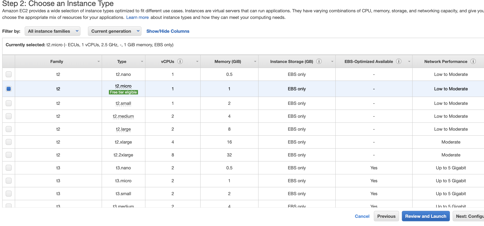

# Installing WRST on AWS

### Pre-Requisites
In order to install WRST on AWS, you must have the following services enabled for your IAM account:

* RDS (Managed Relational Database Service) for hosting your task and response database
* EC2 (Virtual Machine Instance) for hosting your front-end code
* VPC (Virtual Private Cloud) for keeping your services in the same network

These pre-requisites can all be enabled at the free-tier on AWS for a few months.

## (Optional) Setting up a VPC

This step is optional since the RDS service can automatically create a VPC for your database, but if you prefer to give your additional properties up front, you should create one from scratch.


Use the `Launch VPC` wizard. You don't need to make any changes except adding your VPC name.


## Setting up RDS

You need to create a postgres database in your VPC from the last step (or create a new VPC within the RDS wizard). In the wizard, select the 'Postgres' option and feel free to select 'free-tier' if this is for testing purposes.


Set a database name and either enter or auto-generate a password (the password will display afterward if it is auto-generated). Keep your password handy


For your instance, select whichever is appropriate for your needs. In this case, the smallest will do (in order to select the smallest you must check 'include previous generation classes')


Select your VPC or create a new one, and make sure to check the option for 'public access' to the database.


Finally, click 'create'.


Go to your list of databases and check on the status of your database. When it is done setting up, take note of its 'endpoint' and port as you will need those when connecting your virtual machine.


## Setting up your EC2 instance

You will need to set up your EC2 instance to deploy the WRST code and connect to the relational database

Create an EC2 instance using the **Ubuntu 20** image and your preferred tier.




Don't click the 'review and launch' and go to the 'instance configuration' screen and add the instance to your VPC that you created earlier.


Now, go to your list of 'security groups' and select the group attached to your VPC


In your Security Group's settings, go to its 'inbound rules' that govern traffic into that security group, and edit the inbound rules to the following settings:


## Setting up your EC2 instance

Now that you have set up your various resources, you will need to SSH into the ec2 instance and set up WRST. See documentation on [ssh-ing into an EC2 instance](https://docs.aws.amazon.com/AWSEC2/latest/UserGuide/AccessingInstancesLinux.html)

### Installing WRST

Once you are logged in to your instance, clone the WRST repo into your root directory and install your necessary apt dependencies before installing WRST's own deps

```
git clone git@github.com:openstax/research-wrst.git
cd research-wrst
sudo su -
apt-get update
apt-get install python3.8 python3-pip postgresql-client gcc libpq-dev virtualenv redis-server
systemctl start redis.service
systemctl enable redis.service
exit
```

Then go back to your user shell in the `/home/ubuntu/research-wrst` directory and install the rest of your dependencies

```
python3 -m venv env
source env/bin/activate
pip install -r requirements.txt
pip install gunicorn
```

Edit your environment variables to match your environment. Be sure to use the username and password format in the root README of this file to enter your database username and password. You should be able to run the python server from the root directory

```
python -m wrst.app
```

Now you will need to create a `systemd` service. Use the template service in the root directory of this repo (`wrst.service`) but modify the environment variables to match your environment. That file will need to be placed in the `/etc/systemd/system/` folder. Then, when you have it there, execute:

```
sudo systemctl start wrst.service
sudo systemctl enable wrst.service
sudo systemctl status wrst.service
```

You should be able to then see the status of the service. Lastly, you should then go to the URL of your instance at the port and test endpoint `<instance_url>:5000/login_test` and see the WRST app there!

If you don't see it, make sure of the following things:

1. You have opened the right port for the frontend in your security groups
2. Your server can access your RDS instance (use `psql` shell to test this)
3. You are running the redis service (should have been done from the dependencies step)
4. You do not have any issues with your environment variables in your `.service` file.
5. You are going to the `login_test` endpoint.
6. You don't have any issues in your WRST service (use the `status` call from above to check this).

